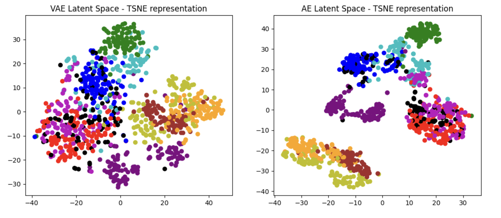

# LatentSpace-Analysis

`LatentSpace_Analysis.ipynb` trains an Autoencoder (AE) and a Variational Autoencoder (VAE) on Fashion-MNIST (or, optionally MNIST) to generate latent space representations learned without supervision. 
The properties of these latent spaces are explored through visualization and direct modification (with corresponding reconstructions), aiming to correlate latent representations with semantic meaning.

### run

I recommend uploading to Google Colab to access a free NVIDIA T4 GPU, which trains the two models quickly. Open `LatentSpace_Analysis.ipynb` and upload `models.py` and `utils.py` 

If you must train the models on a CPU, reduce the training time by modifying `num_epochs = 8` to `num_epochs = 2` in the third code cell of the notebook.

Note that the notebook trains a VAE and an AE on the same data for comparison of regularized & unregularized latent spaces.

### Context

Unsupervised learning is a powerful machine learning technique that has exploded in popularity as a component of LLMs. 

Although the VAE was proposed more than a decade ago, the interpretability techniques applied in this notebook remain relevant to modern LLMs such as Claude 3 Sonnet (link). While Similar in 
spirit, this repo analyzes latent representations generated by smaller, more accessbile models, in order to focus on visualization of latent space properties and encourage experimentation.

### Findings

**Latent Space Visualization**

A simple t-SNE visualization of the latent spaces reveals strong class groupings by both models. Without labels or any explicit incentive to do so, these models learn to group images by their 
class labels.

Further, there is a visible contrast between the VAE's regularized and probabilistic latent space and the AE's unregularized and deterministic latent space: VAE class groupings are closer together than
AE class groupings. 

The 'smoothness' of a VAE's latent space allows the VAE to generate completely new samples from random latent vectors. Being deterministic, and without regularization, an AE never assigns any meaning 
to latent vectors that aren't generated during training, making it a poor random image generator. The notebook demonstrates this with, VAE & AE reconstructions of the same random latent vectors.

Visualizing the latent vectors directly, two dimensions at a time, makes this more concrete. VAE latent vectors generated from the dataset are seen grouped around (0, 0) due to the 
regularizing effect of the KL divergence toward N(0, 1) in its loss function. The AE latent space shows scattered latents in the absence of this regularization.

The notebook also demonstrates the drawback of latent space regularization. Reconstructions of images from the VAE are blurry compared to the AE's reconstructions. The KL term in the VAE's loss forces it
to optimize multiple values and reduces precision.

**Modifying Latent Vectors & Latent Space Arithmetic**

In models as small as the ones trained here (latent vectors of length 24 by default), manually modifying latent vectors and viewing the resulting reconstructions often reveals the semantic meaning of 
entries in that latent vector. This is demonstrated in the notebook. Below is a strong example: reconstructions of modifications to entry 17 of a latent vector show it controls the mass in the center of
the image. 

Latent space arithmetic is a concept highly relevant in even the largest models. The famous example is `king - man + woman = queen` in the word embeddings used by LLMs. The below example shows 
reconstructions of latent space arithmetic `t-shirt + (long sleeve shirt - t-shirt)` or more simply, t-shirt + sleeves (difference btwn long-sleeve & t-shirt). 

### References 

